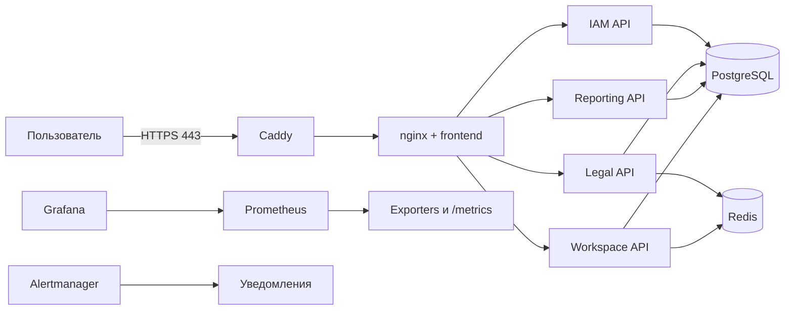

# Архитектура

## Границы системы

Первый промышленный запуск планируется на одном on-premise сервере в защищённом контуре.
Отказоустойчивость уровня нескольких физических узлов не заявляется. Внешний доступ разрешается
только через корпоративную сеть или VPN.

## Планируемые дополнения перед промышленным запуском

- PgBouncer между API и PostgreSQL после настройки и нагрузочного теста.
- Prometheus, Grafana, Alertmanager, node-exporter, cAdvisor, postgres-exporter, redis-exporter.
- Выделенное объектное хранилище при включении загрузки файлов.
- Внешняя резервная копия за пределами основного сервера.
